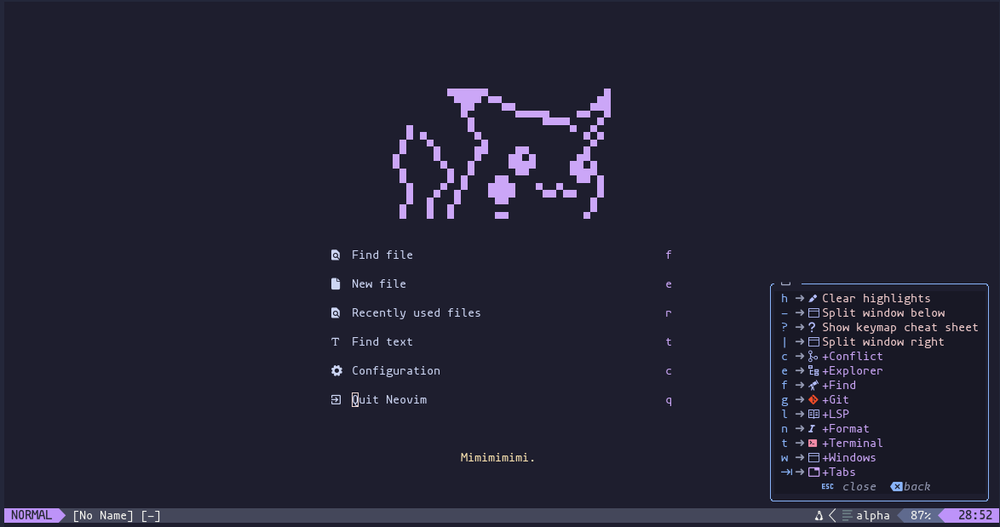

# Nvim config that i use
*nvim should be built with 9.4 or higher*

# Keybinds

> **SuperKey:** Space

## Normal Vim Keybinds
| Action | Key |
|--------|-----|
| Remove highlights | Super + `h` |
| Move panes | Ctrl + `h/j/k/l` |

## Telescope
| Action | Key |
|--------|-----|
| Find files | Super + `f f` |
| Live grep (requires ripgrep) | Super + `f g` |
| Recent files | Super + `f r` |

## File Explorer (nvim-tree)
| Action | Key |
|--------|-----|
| Toggle filesystem | Super + `e e` |
| Toggle current buffer in tree | Super + `e b` |

## LSP
| Action | Key |
|--------|-----|
| Hover documentation | Shift + `l h` |
| Go to definition | Super + `l d` |
| List references | Super + `l r` |
| Code actions | Super + `l a` |

## null-ls Formatting
| Action | Key |
|--------|-----|
| Format buffer | Shift + `n f` |

## Completion (nvim-cmp)
| Action | Key |
|--------|-----|
| Confirm selection | Ctrl + `Space` / `Enter` |
| Next item | 'Tab' / Ctrl + `e` |
| Previous item | Shift + `<Tab>` / Ctrl + `b` |

## Gitsigns
| Action | Key |
|--------|-----|
| Preview diff hunk | Super + `g p` |
| Git blame current line | Super + `g t` |

## Git Conflict

| Action | Key |
|--------|------------|
| Jump to next conflict | Super + `c n` |
| Jump to previous conflict | Super + `c p` |
| Keep **our** changes | Super + `c o` |
| Keep **their** changes | Super + `c t` |
| Keep **both** changes | Super + `c b` |
| Discard **both** changes | Super + `c 0` |

## Window Management
| Action               | Key              |
|----------------------|------------------|
| Split window below   | Super + `-`      |
| Split window right   | Super + `\|`      |
| Close current window | Super + `w d`    |

## Tabs
| Action                 | Key                     |
|------------------------|-------------------------|
| New tab                | Super + `<Tab><Tab>`    |
| Next tab               | Super + `<Tab>]`        |
| Previous tab           | Super + `<Tab>[`        |
| Last tab               | Super + `<Tab>l`        |
| First tab              | Super + `<Tab>f`        |
| Close tab              | Super + `<Tab>d`        |
| Close other tabs       | Super + `<Tab>o`        |

## Terminal
| Action               | Key              |
|----------------------|------------------|
| Toggle last terminal | Ctrl + `\` / Super + `t t`    |
| Toggle Lazygit       | Super + `t l`    |
| Floating terminal    | Super + `t f`    |
| Horizontal terminal  | Super + `t h`    |
| Vertical terminal    | Super + `t v`    |
| Exit terminal        | Ctrl + `\` / <esc> / jk / Super + `t t`|

